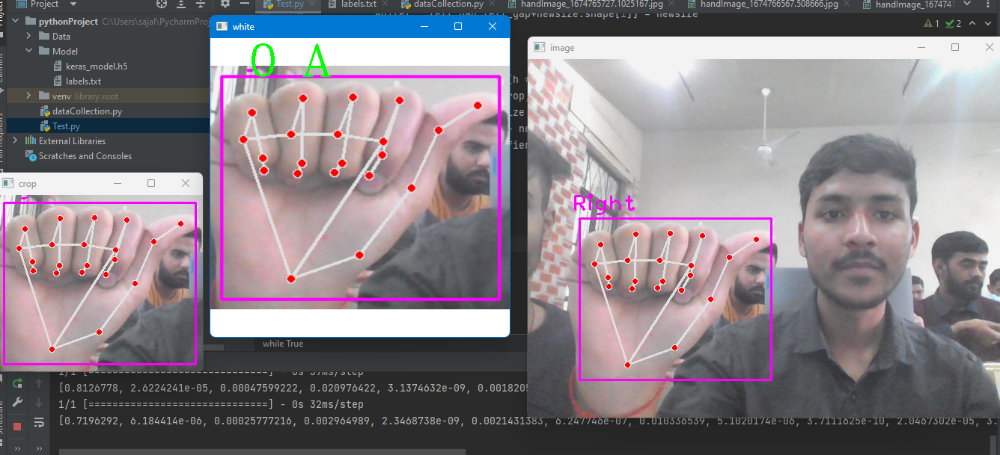

# American Sign Language Alphabet Recognition

This project aims to recognize American Sign Language (ASL) alphabet signs using hand gesture images. It uses computer vision techniques to identify the alphabet based on the input hand gesture.

## Features

- **Real-Time Gesture Recognition:** Recognizes ASL alphabets based on live hand gestures.
- **Image Processing:** Utilizes advanced image processing techniques to detect and classify hand gestures.
- **User-Friendly Interface:** Simple and intuitive interface for users to interact with the system.

## How It Works

1. **Capture Hand Gesture:** The system captures an image of the user's hand gesture.
2. **Process the Image:** The captured image is processed to identify key features.
3. **Classify the Gesture:** Based on the processed features, the system predicts the corresponding ASL alphabet.
4. **Display Result:** The predicted alphabet is displayed on the screen.

## Working project images



### Installation

1. Clone the repository:
   ```bash
   git clone https://github.com/Sajalrastogi89/SignLanguage.git
